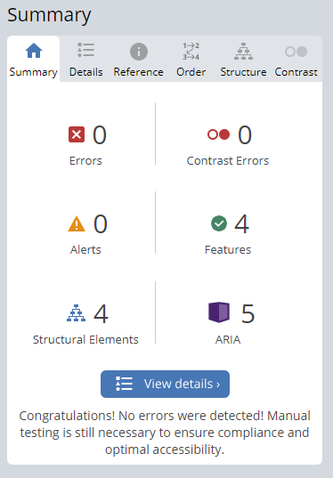

# Age calculator app challenge on Frontend Mentor

This is a solution to the [Age calculator app challenge on Frontend Mentor](https://www.frontendmentor.io/challenges/age-calculator-app-dF9DFFpj-Q). Frontend Mentor challenges help you improve your coding skills by building realistic projects.  


## Technologies Used

This project utilizes the following technologies:

* HTML & CSS & Ts
* Tailwind
* Angular  

## Key Features

* Accessible app (Perfect usage of aria rules)
* Responsive design - Pixel Perfect (almost identical to Figma)
* Clean Markup (Meet WCAG standards by using Semantic HTML)

## Getting Started

To run this app in development mode open the terminal and write the following:

```sh  
git clone https://github.com/Zakaria9375/fm-age-calculator.git   
cd fm-age-calculator  
npm install

# If Angular CLI is not installed
npm install -g @angular/cli

ng serve
# To calculate your age, start the server and navigate to:
http://localhost:4200
# Enter your birth date in the form and submit to see the results.
```

## Useful Links

* [Project Challenge on Frontend Mentor](https://www.frontendmentor.io/challenges/age-calculator-app-dF9DFFpj-Q)  
* [Live Demo](https://za-age-calculator.netlify.app/)

## Accessibility

This application has been tested extensively for accessibility, including:

* Zooming Compatibility: Content remains visible will zooming.
* Text-only Zoom: No loss of content till 200%.
* Keyboard Navigation: Interactive elements are accessible(focusable) and clickable.
* Static code analysis: Regularly performed to maintain and ensure perfect compliance with accessibility standards.



## About the Author

* Portfolio - [Zakaria Ali](https://zaportfolio.com/)
* Frontend Mentor Profile - [@Zakaria9375](https://www.frontendmentor.io/profile/Zakaria9375)
* Project by - [Frontend Mentor team](https://www.frontendmentor.io/)

## Contributing

**Want to contribute?** *Great!* Here’s how you can help:

1. Fork the repo and create your branch from `main`.
2. Make your changes and test.
3. Issue that "pull" request!

## License


Copyright (c) 2024-present, Zakaria Ali

